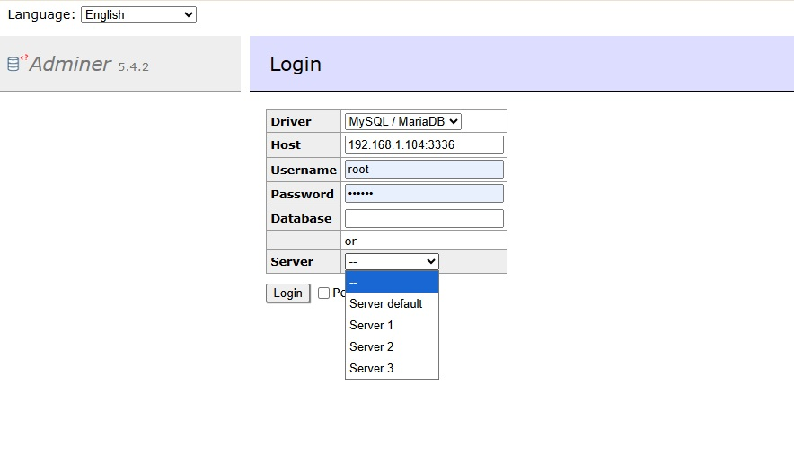

# adminer-link-login-servers

```txt
v4/
├─ index.php
├─ adminer-4.8.1.php
├─ adminer-4.17.1.php
├─ plugins/
│  └─ plugin.php
│  └─ login-servers.php
│  └─ _config-server.json
```


```txt
v5/
├─ index.php
├─ adminer-5.0.5.php
├─ adminer-5.4.2.php
├─ plugins/
│  └─ plugin.php
│  └─ login-servers.php
│  └─ _config-server.json
```


# Adminer Login Servers

A small Adminer plugin/customization to add a predefined server dropdown on the login page.

It makes login easier by showing a server selector


## Example Configuration

Add your saved servers in `index.php`:
or file 
```
plugins/_config-server.json
```

```php
$_ENV['ADMINER_SERVERS'] = json_encode([
    "Server default" => [
        "driver" => "server",
        "server" => "127.0.0.1:3306",
        "username" => "root",
        "password" => "",
        "db" => "",
    ],
    "Server 1" => [
        "driver" => "server",
        "server" => "127.0.0.1:3307",
        "username" => "root",
        "password" => "",
        "db" => "",
    ],
    "Server 2" => [
        "driver" => "server",
        "server" => "127.0.0.1:3308",
        "username" => "root",
        "password" => "",
        "db" => "",
    ],
]);
```

## Field Description

| Field      | Description                                               |
| ---------- | --------------------------------------------------------- |
| `driver`   | Database type. Use `server` for MySQL/MariaDB.            |
| `server`   | Database host and port. Example: `127.0.0.1:3306`.        |
| `username` | Default database username.                                |
| `password` | Default database password. Leave empty if not needed.     |
| `db`       | Default database name. Leave empty to choose after login. |

## Usage

Open Adminer through `index.php`, not directly through the Adminer PHP file.

Correct:

```txt
http://localhost/adminer/v4/
http://localhost/adminer/v5/
```

Avoid:

```txt
http://localhost/adminer/v4/adminer-4.8.1.php
```

After opening Adminer, select a saved server from the dropdown and log in normally.

## Note

This is intended for local development or internal tools only.
Do not expose Adminer publicly without additional protection such as IP restriction, Basic Auth, or VPN access.


View demo   


Reference link
```
https://github.com/vrana/adminer/releases/
https://github.com/garis-space/adminer-login-servers
```
